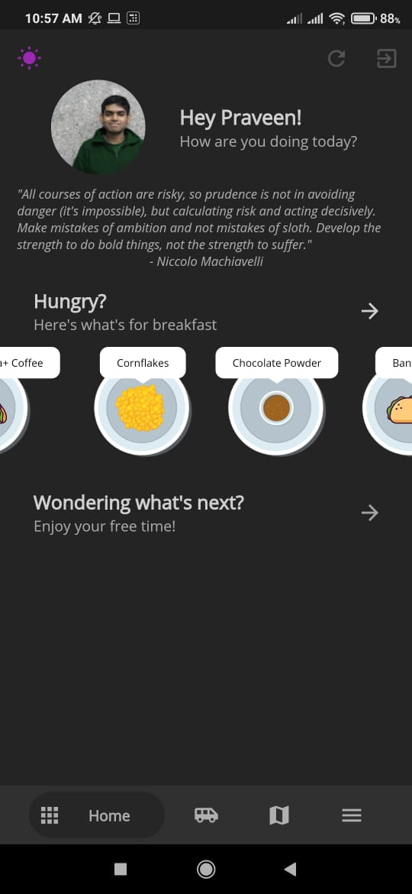
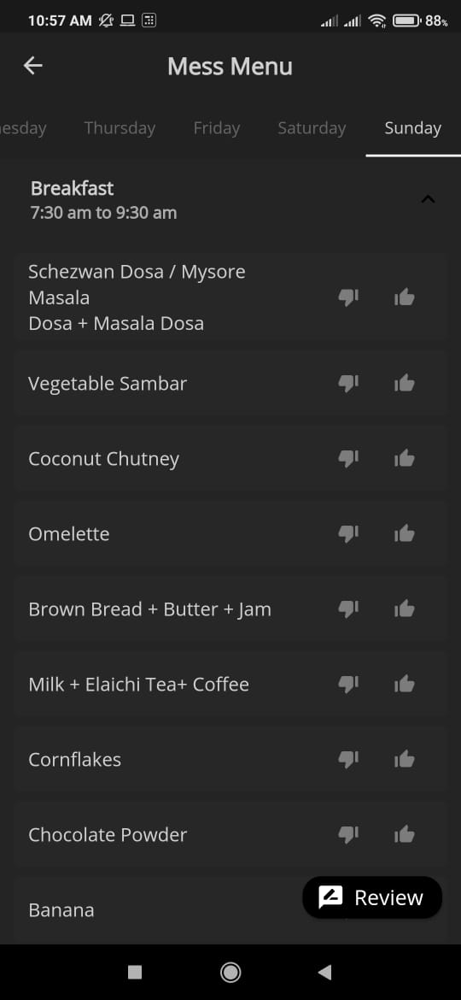
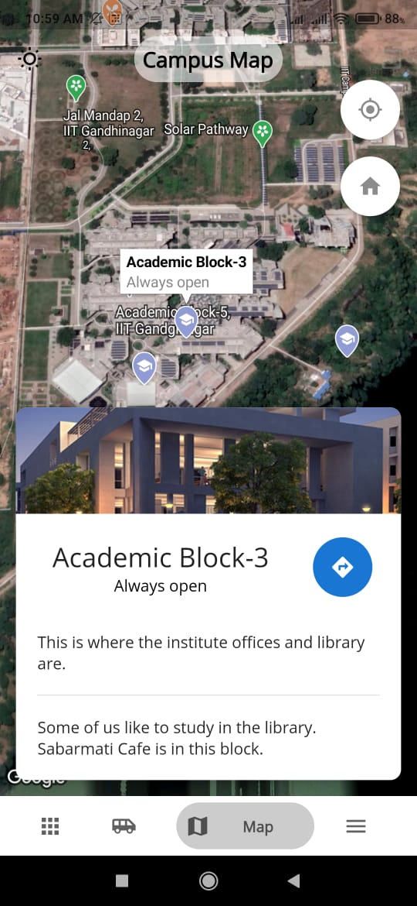
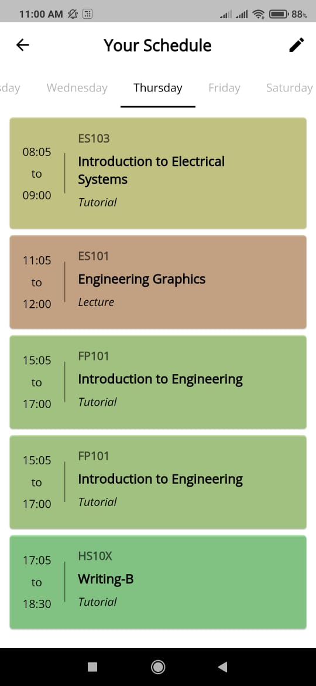

## InsIIT - IITGn's Official Institute App
<!-- ALL-CONTRIBUTORS-BADGE:START - Do not remove or modify this section -->

<!-- ALL-CONTRIBUTORS-BADGE:END -->

You've stumbled across the official FOSS repository of IITGn's Institute App! This project is in its infant stages, and all contributions in any form are welcome :)

This is the official discord server for insIIT Developers Community: [insIIT Developers Community](https://discord.gg/cVeY6GwMV7)

## Motivation
Kicked off via HackRush 2019, this project was brought to life with a vision to create a one-stop-serves-all platform for all members of the community. The project incorporates several aspects of the campus, and deeply integrates into services that we use daily. Our vision is to see this project becoming a one-of-a-kind open source project that allows students to up-skill themselves while contributing to something that everyone on campus uses!

This project is the successor to GNius - the first students mobile app for android.
## Screenshots

## Tech/framework used
- Frontend - Flutter
- Backend - Node.js (Deployed on IITGN Servers) + MongoDb (Atlas), Google Sheets, FireBase

## Features
### Stable Release
- Mess Menu
  - View daily Menu
  - Send instant feedback on items (Upvote/Downvote), or a more detailed review.
- Daily schedule 
  - Courses are automatically updated depending on the semester with unenroll/enroll option
  - Exams are automatically added during midsem/endsem
  - Calendar events will be shown as well.
- Bus
  - Set reminders for bus you want to catch
  - View Bus routes

### Beta Release
- News feed of announcements/events

### Alpha Release (In-progress/todo - Contributions welcome!)
- Integration of room booking system 
  - Tinkerers Lab
    - Automatic allotment of 3D printers/laser cutters
  - Academic Block booking

- Integration of Bus service with live GPS info of buses (project under IBP, IR&P council)
- Integration with Events API of IITGn
- Integration with Stumble

## APIs
A large part of this project runs off the Google Sheet API due to its ease of being modified without any technical knowledge whatsoever, along with full securty. 

## Team InsIIT
We would love to have you onboard! Do submit a pull request if you would like to contribute to a feature.

<!-- ALL-CONTRIBUTORS-LIST:START - Do not remove or modify this section -->
<!-- prettier-ignore-start -->
<!-- markdownlint-disable -->
<table>
  <tr>
    <td align="center"><a href="http://praveenvnktsh.github.io"> <b>Praveen Venkatesh</b></a> <a href="https://github.com/praveenVnktsh/IITGN-Institute-App/commits?author=praveenVnktsh" title="Code">💻</a><a href="#ideas-Gaurav7214" title="Ideas, Planning, & Feedback">🤔 <a href="https://github.com/praveenVnktsh/IITGN-Institute-App/commits?author=praveenVnktsh" title="Documentation">📖</a> <a href="#design-praveenVnktsh" title="Design">🎨</a> <a href="#maintenance-praveenVnktsh" title="Maintenance">🚧</a></td>
     <td align="center"><a href="https://github.com/GauravViramgami"> <b>Gaurav Viramgami</b></a> <a href="https://github.com/praveenVnktsh/IITGN-Institute-App/commits?author=Gaurav7214" title="Code">💻</a> <a href="#ideas-Gaurav7214" title="Ideas, Planning, & Feedback">🤔</a> <a href="#maintenance-Gaurav7214" title="Maintenance">🚧</a></td>
    <td align="center"><a href="https://github.com/nishikantparmariam"> <b>Nishikant Parmar</b></a> <a href="https://github.com/praveenVnktsh/IITGN-Institute-App/commits?author=nishikantparmariam" title="Documentation">📖</a> <a href="https://github.com/praveenVnktsh/IITGN-Institute-App/commits?author=nishikantparmariam" title="Code">💻</a> <a href="#ideas-nishikantparmariam" title="Ideas, Planning, & Feedback">🤔</a> <a href="#maintenance-nishikantparmariam" title="Maintenance">🚧</a></td>
    <td align="center"><a href="http://linkedin.com/in/chrisfrancis09"> <b>Chris Francis</b></a> <a href="https://github.com/praveenVnktsh/IITGN-Institute-App/commits?author=frank-chris" title="Code">💻</a> <a href="#ideas-frank-chris" title="Ideas, Planning, & Feedback">🤔</a> <a href="#design-frank-chris" title="Design">🎨</a></td>
    <td align="center"><a href="https://github.com/KritikaKumawat3108"> <b>KritikaKumawat3108</b></a> <a href="https://github.com/praveenVnktsh/IITGN-Institute-App/commits?author=KritikaKumawat3108" title="Code">💻</a> <a href="#maintenance-KritikaKumawat3108" title="Maintenance">🚧</a></td>
        <td align="center"><a href="https://github.com/27Anurag"> <b>27Anurag</b></a> <a href="https://github.com/praveenVnktsh/IITGN-Institute-App/commits?author=27Anurag" title="Code">💻</a> <a href="#maintenance-27Anurag" title="Maintenance">🚧</a></td>
  </tr>
</table>

<!-- markdownlint-restore -->
<!-- prettier-ignore-end -->

<!-- ALL-CONTRIBUTORS-LIST:END -->

## Mentions

We would like to thank  Shantanu Jana (Class of '21), Jainam Shah (Class of '21), Shreyas Singh (Class of '20), Animesh Rastogi (Class of '20), and Rohit Patil (Class of '21) for their valuable help in securing the required logistics for the project.

